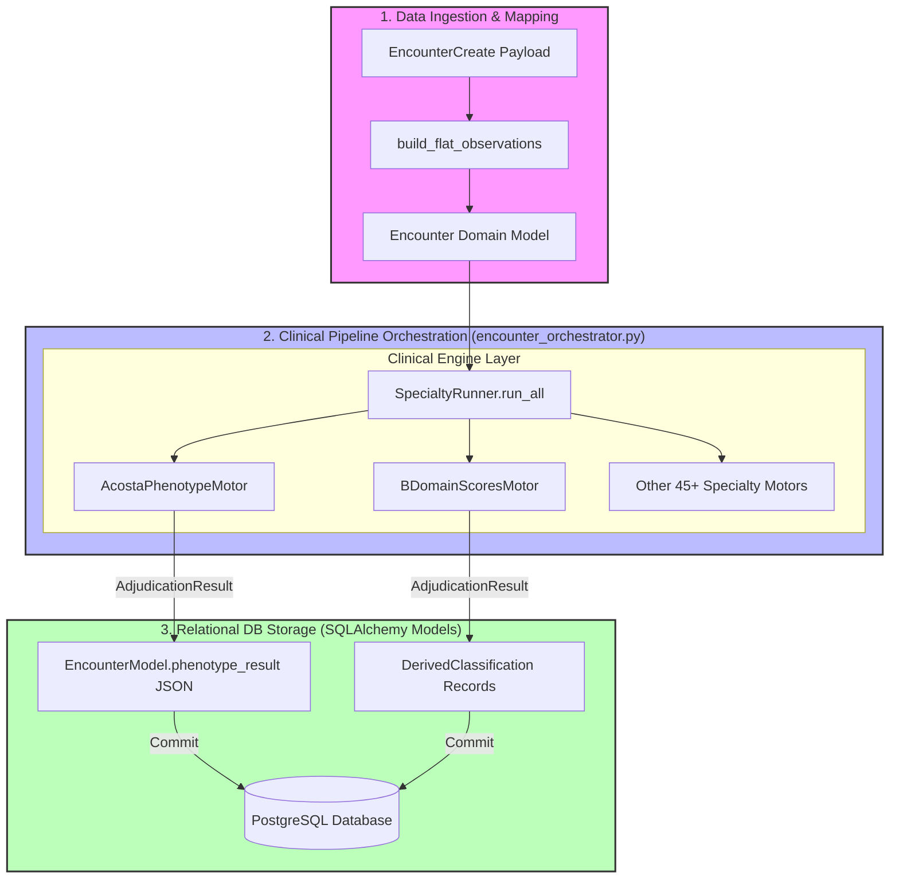

# CDSS Architecture Notes — Integrum V2
**Standard Alignment:** IEC 62304 / ISO 13485
**Status:** Orientation & Inventory Complete
**Date:** 2026-06-07

---

## 1. System Architectural Topology

The following diagram illustrates how clinical inputs are ingested, processed through pure clinical engines, orchestrated asynchronously, and persisted in the database as structured classifications.

---

## 2. Inventory of Current Phenotypes & Domains

### 2.1 Layer A (Biological/Metabolic Phenotypes)
Processed by [acosta.py](file:///Users/antonymolinagarrido/Projects/integrum_v2/apps/backend/src/engines/acosta.py):
*   **Cerebro Hambriento (Saciación Retrasada):** Driven by ad-libitum intake vs. weight/sex thresholds.
*   **Intestino Hambriento (Saciedad Temprana):** Evaluated via gastric emptying rate scintigraphy ($T_{1/2} < 85$ min) or questionnaire indices.
*   **Hambre Emocional (Hedónica):** Cluster of GAD-7 $\ge 10$, TFEQ-Emotional $> 2.5$, and TFEQ-Uncontrolled $> 2.5$.
*   **Quema Lenta (Gasto Limitado):** Indicated by measured resting energy expenditure (REE) deficit vs. Mifflin-St Jeor ($< 85\%$) and Cunningham ($< 90\%$) equations, or decreased Skeletal Muscle Index (SMI).

### 2.2 Layer B (Psychosocial & Behavioral Domains)
Processed by [b_domains.py](file:///Users/antonymolinagarrido/Projects/integrum_v2/apps/backend/src/engines/specialty/b_domains.py):
*   `B_AFFECT` (PHQ-9): Minimal, mild, moderate, or severe depressive load.
*   `B_ANXIETY` (GAD-7): Minimal, mild, moderate, or severe anxiety.
*   `B_UNCONTROLLED` (TFEQ-Uncontrolled): Uncontrolled eating behavior (normal vs. elevated).
*   `B_EMOTIONAL` (TFEQ-Emotional): Emotional eating response (normal vs. elevated).
*   `B_COGNITIVE` (TFEQ-Cognitive): Cognitive restraint level (low vs. active).
*   `B_SLEEP` (Athens Insomnia Scale): Sleep quality (normal, borderline, or probable insomnia).

---

## 3. Inventory of Verification Unit Tests

The test suite validates clinical behavior and engine rules:
*   [test_acosta.py](file:///Users/antonymolinagarrido/Projects/integrum_v2/apps/backend/tests/unit/engines/test_acosta.py): Verifies Acosta confidence score calculations (0.85, 0.72, 0.60) based on BMR, Cunningham/Mifflin thresholds, SMI, and missing-data flags (missing BIA-BMR).
*   [test_b_domains.py](file:///Users/antonymolinagarrido/Projects/integrum_v2/apps/backend/tests/unit/engines/test_b_domains.py): Validates score-to-severity mappings for all 6 behavioral domains, confirming correct outputs for complete and partial profiles.
*   [test_derived_classifications.py](file:///Users/antonymolinagarrido/Projects/integrum_v2/apps/backend/tests/test_derived_classifications.py): Verifies that the asynchronous orchestrator intercepts engine outputs and saves them correctly as `DerivedClassification` records with accurate completeness states.

---

## 4. Gaps & Next Steps

### 4.1 Missing Linkage to Clinical Decisions
*   Although Acosta output generates suggestions in `recomendacion_farmacologica` inside the API payload, there is no formal linkage mapping combinations of Layer A (basal metabolism) and Layer B (behavioral/emotional profiles) to concrete, tailored medication or follow-up schedules.

### 4.2 Absence of Longitudinal Layer C
*   The persistence layer records individual encounters, but the system does not compute longitudinal trajectories (Layer C). There is no calculation of early response at 4/12 weeks (e.g., $\ge 5\%$ weight loss target), nor tracking of adherence dynamics over time.

### 4.3 Technical Debt
*   **Decoupled Classifications:** Currently, B domains are flattened in the DB as separate records, but there is no engine compiling a unified behavioral archetype to coordinate with the biological phenotype.
